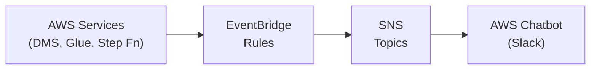

# AWS Data Pipeline Notifications

[](https://aws.amazon.com/cdk/)
[](https://www.python.org/)
[](LICENSE)

> **Event-driven notification system for AWS data pipeline monitoring and alerting**

This CDK project provides a robust, serverless notification system for monitoring AWS data pipeline errors and failures. It automatically captures error events from DMS, Glue, and Step Functions using Amazon EventBridge, then routes them to SNS topics integrated with AWS Chatbot for real-time Slack notifications.

## 🏗️ Architecture



## ✨ Features

- **Multi-Service Monitoring**: Captures errors from DMS, AWS Glue, and Step Functions
- **Real-time Notifications**: Instant Slack alerts via AWS Chatbot integration
- **Event-Driven Architecture**: Uses EventBridge for scalable, serverless event processing
- **Infrastructure as Code**: Fully defined using AWS CDK for reproducible deployments
- **Cost-Effective**: Pay-per-use serverless architecture with minimal overhead

## 🚀 Quick Start

### Prerequisites

- AWS CLI configured with appropriate permissions
- Python 3.8 or higher
- Node.js (for AWS CDK)
- AWS CDK v2.x installed globally

### Installation

1. **Clone the repository**
   ```bash
   git clone https://github.com/Manuelacosta98/aws-data-pipeline-notifications.git
   cd aws-data-pipeline-notifications
   ```

2. **Set up Python virtual environment**
   ```bash
   python3 -m venv .venv
   source .venv/bin/activate  # On Windows: .venv\Scripts\activate.bat
   ```

3. **Install dependencies**
   ```bash
   pip install -r requirements.txt
   pip install -r requirements-dev.txt  # For development
   ```

4. **Bootstrap CDK (first time only)**
   ```bash
   cdk bootstrap
   ```

### Deployment

1. **Synthesize CloudFormation template**
   ```bash
   cdk synth
   ```

2. **Deploy the stack**
   ```bash
   cdk deploy
   ```

3. **Configure AWS Chatbot** (Post-deployment)
   - Navigate to AWS Chatbot console
   - Configure Slack workspace integration
   - Subscribe to the created SNS topics

## 🛠️ Configuration

### Environment Variables

Set the following environment variables or modify `app.py`:

```python
env=cdk.Environment(
    account='your-account-id',
    region='your-preferred-region'
)
```

### Customization

The stack can be customized by modifying `aws_data_pipeline_notifications_stack.py`:

- Add additional AWS services to monitor
- Configure custom EventBridge rules
- Set up multiple notification channels
- Add filtering and routing logic

## 📁 Project Structure

```
aws-data-pipeline-notifications/
├── app.py                           # CDK app entry point
├── cdk.json                         # CDK configuration
├── requirements.txt                 # Python dependencies
├── requirements-dev.txt             # Development dependencies
├── infra/
│   ├── __init__.py
│   └── aws_data_pipeline_notifications_stack.py
└── tests/
    ├── __init__.py
    └── unit/
        ├── __init__.py
        └── test_aws_data_pipeline_notifications_stack.py
```

## 🧪 Testing

Run the test suite:

```bash
python -m pytest tests/
```

For test coverage:

```bash
python -m pytest --cov=aws_data_pipeline_notifications tests/
```

## 📚 CDK Commands

| Command | Description |
|---------|-------------|
| `cdk list` | List all stacks in the app |
| `cdk synth` | Synthesize CloudFormation template |
| `cdk deploy` | Deploy stack to AWS |
| `cdk diff` | Compare deployed stack with current state |
| `cdk destroy` | Remove the deployed stack |
| `cdk docs` | Open CDK documentation |

## 🤝 Contributing

1. Fork the repository
2. Create a feature branch (`git checkout -b feature/amazing-feature`)
3. Commit your changes (`git commit -m 'Add amazing feature'`)
4. Push to the branch (`git push origin feature/amazing-feature`)
5. Open a Pull Request

## 📄 License

This project is licensed under the MIT License - see the [LICENSE](LICENSE) file for details.

## 🆘 Support

- **Issues**: Report bugs and request features via [GitHub Issues](https://github.com/Manuelacosta98/aws-data-pipeline-notifications/issues)
- **Documentation**: Check the [AWS CDK Documentation](https://docs.aws.amazon.com/cdk/)
- **Community**: Join the [AWS CDK Community](https://github.com/aws/aws-cdk)

## 🏷️ Tags

`aws` `cdk` `data-pipeline` `notifications` `eventbridge` `sns` `chatbot` `slack` `monitoring` `serverless`
