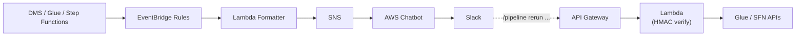

# AWS Data Pipeline Notifications

[](https://github.com/Manuelacosta98/aws-data-pipeline-notifications/actions/workflows/ci.yml)
[](https://aws.amazon.com/cdk/)
[](https://www.python.org/)
[](https://github.com/astral-sh/uv)
[](LICENSE)

> Bidirectional Slack ↔ AWS for data pipeline operations. Alerts flow outbound (EventBridge → Chatbot → Slack); `/pipeline rerun` slash commands flow inbound (API Gateway → Lambda → Glue / Step Functions). Deployed from CI via passwordless GitHub OIDC.

## What this solves

Most data pipelines fail silently — a Glue job dies at 2 AM, a DMS task stops mid-stream, a Step Functions execution times out, and nobody knows until a dashboard looks wrong the next morning. Even once you know, fixing it usually means SSH-ing into a console.

This project closes both halves of the loop:

1. **Outbound** — catches failures from DMS, AWS Glue, Step Functions, and QuickSight in near real time, classifies them by severity (🚨 / ⚠️ / ✅ / ℹ️), and posts rich Slack messages with deep links to the AWS console. QuickSight alerts are *actively enriched* via the QuickSight API to resolve dataset IDs to human-readable names and pull the detailed error message.
2. **Inbound** *(opt-in)* — exposes a `/pipeline rerun glue <job>` slash command. The alert itself contains the exact command. One alert, one command, the job restarts. No console.
3. **Proactive monitors** *(opt-in)* — covers the gap that AWS doesn't emit events for: Redshift COPY load errors (in `stl_load_errors`) and DMS field-level errors (in CloudWatch Logs). Polling Lambdas emit `custom.*` EventBridge events that flow through the same formatter as native AWS sources. Invokable on-demand from Slack via `@aws lambda invoke`.

## Architecture (one-paragraph version)

Six CDK stacks, four always-on and two opt-in. `EventBridgeStack` listens to AWS source events and routes them through a Lambda formatter to SNS. `ChatBotStack` subscribes Chatbot to that topic and posts into Slack. `SlackActionsStack` is an HTTP API + Lambda that receives signed slash commands and re-runs jobs. `RedshiftMonitorStack` and `DmsMonitorStack` are opt-in pollers that emit `custom.*` events for error sources AWS doesn't emit natively. `GithubOIDCRoleStack` provisions the OIDC role CI uses for passwordless deploys.


```mermaid
flowchart LR
  A["DMS / Glue / Step Functions"] --> B["EventBridge Rules"]
  B --> C["Lambda Formatter"] --> D["SNS"] --> E["AWS Chatbot"] --> F["Slack"]
  F -. "/pipeline rerun ..." .-> G["API Gateway"]
  G --> H["Lambda<br/>(HMAC verify)"] --> I["Glue / SFN APIs"]
```

For everything else — architecture deep-dive, security model, ADRs, operations runbook — see **[`docs/`](docs/README.md)**.

## Quick Start

```bash
git clone https://github.com/Manuelacosta98/aws-data-pipeline-notifications.git
cd aws-data-pipeline-notifications

uv sync --dev                                   # install deps
cp .env.example .env && $EDITOR .env            # set Slack workspace/channel IDs
uv run cdk bootstrap                            # first time only
uv run cdk deploy EventBridgeStack ChatBotStack
uv run pytest                                   # 46 tests, ~96% coverage
```

AWS credentials come from the standard AWS provider chain (SSO, named profile, instance role) — **never** put long-lived access keys in `.env`.

## Documentation

| Doc                                                                       | What's in it                                                        |
|---------------------------------------------------------------------------|---------------------------------------------------------------------|
| [Architecture](docs/architecture.md)                                      | System overview, stacks, data flow, cross-stack contracts          |
| [Outbound alerts](docs/outbound-alerts.md)                                | EventBridge → Lambda → SNS → Chatbot → Slack, in detail            |
| [Inbound actions](docs/inbound-actions.md)                                | `/pipeline` slash command setup and runtime semantics              |
| [Proactive monitors](docs/proactive-monitors.md)                          | Redshift + DMS pollers, custom event sources, QuickSight enrichment |
| [Severity classification](docs/severity-classification.md)                | The 4 tiers and how the formatter dispatches them                  |
| [Security](docs/security.md)                                              | HMAC, replay protection, IAM least-privilege, allowlists, OIDC     |
| [CI/CD](docs/cicd.md)                                                     | GitHub OIDC role, workflow, deploy story                           |
| [Testing strategy](docs/testing-strategy.md)                              | Synth-level vs. handler-level tests, mocking patterns              |
| [Operations](docs/operations.md)                                          | Runbook: deploy, rotate, allowlist, debug, decommission            |
| [Patterns and practices](docs/patterns-and-practices.md)                  | Catalog of the architecture patterns this project follows          |
| [Architecture Decision Records](docs/adr/README.md)                       | 6 ADRs covering the major design choices                           |

## License

MIT — see [LICENSE](LICENSE).
