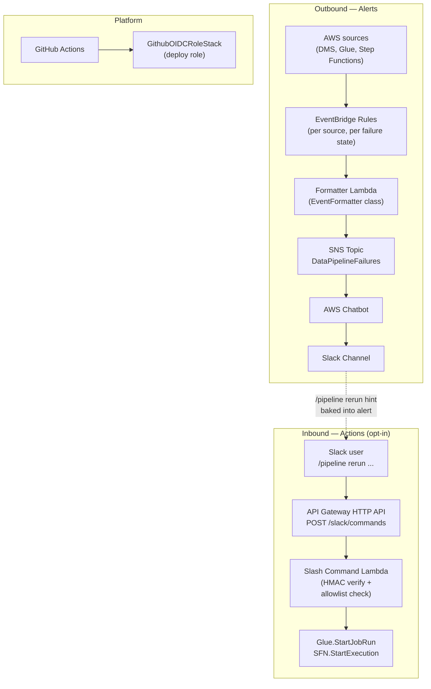

# Architecture

This document describes the system's shape: the four CDK stacks, the runtime data flow, the contracts between stacks, and the deployment topology.

## System diagram



## Four stacks, four concerns

| Stack                  | Responsibility                                                                                   | Lifetime                              |
|------------------------|--------------------------------------------------------------------------------------------------|---------------------------------------|
| `EventBridgeStack`     | Listens to AWS source events; runs the formatter Lambda; publishes to SNS.                       | Deployed on every release.            |
| `ChatBotStack`         | Subscribes AWS Chatbot to the SNS topic and routes messages into a Slack channel.                | Deployed on every release.            |
| `SlackActionsStack`    | HTTP API + Lambda + Secrets Manager entry that receives `/pipeline` slash commands from Slack.    | Opt-in. Deployed when bidirectional flow is enabled. |
| `RedshiftMonitorStack` | Polling Lambda that scans `stl_load_errors` and emits `custom.redshift` events.                   | Opt-in. Deployed when proactive monitoring is enabled. |
| `DmsMonitorStack`      | Polling Lambda that combines DMS table stats + CloudWatch `]E:` logs and emits `custom.dms` events. | Opt-in. Deployed when proactive monitoring is enabled. |
| `GithubOIDCRoleStack`  | IAM role + OIDC provider trusting only this GitHub repo; used by CI for passwordless deploys.    | Bootstrap. Deploy once, manually.     |

Each stack stands alone. Cross-stack references are explicit and minimal — see [Cross-stack contracts](#cross-stack-contracts) below.

## Data flow

### Outbound: AWS event → Slack alert

1. **AWS service emits a native event.** Glue, DMS, and Step Functions all publish state-change events to the default EventBridge bus without any configuration on our side.
2. **EventBridge rules filter.** Defined in `infra/eventbridge_stack.py`. One rule per source × failure state set: e.g. Step Functions with status `FAILED|TIMED_OUT|ABORTED`. Success rules are gated on the `notifyOnPipelineSuccess` context flag — see [ADR-002](adr/002-aws-chatbot-for-outbound.md) for why this matters.
3. **Formatter Lambda runs.** `lambda/lambda_formatter.py` is a 13-line handler. It instantiates an `EventFormatter` once at module-import time and reuses it across warm invocations. The class dispatches on `source` + `detail-type` to one of `_format_glue`, `_format_step_functions`, `_format_dms_task`, `_format_dms_table`, or `_format_unknown`. See [severity classification](severity-classification.md) for the dispatch logic.
4. **SNS publishes.** The formatter produces an AWS-Chatbot custom-format payload and publishes it to the `DataPipelineFailures` SNS topic.
5. **AWS Chatbot routes to Slack.** The Chatbot stack subscribes a `SlackChannelConfiguration` to that topic. Chatbot renders the message in Slack with the deep-link to the AWS console.

### Inbound: Slack command → AWS API

1. **User types `/pipeline rerun glue customer_etl_daily` in Slack.** Slack's slash-command runtime POSTs to our HTTP API with two security-relevant headers: `X-Slack-Request-Timestamp` and `X-Slack-Signature`.
2. **API Gateway HTTP API forwards to Lambda.** No usage plan, no API key — Slack-signing-secret verification is the trust boundary.
3. **`slack_command_handler.lambda_handler` runs.** It:
   - Loads the Slack signing secret from Secrets Manager (cached for 5 minutes).
   - Verifies HMAC-SHA256 of `v0:<timestamp>:<body>` against the `X-Slack-Signature` header. Rejects forged or > 5-minute-old requests with HTTP 401.
   - Parses the form-encoded body and extracts `text` and `user_id`.
   - Checks the requested job/state-machine against `ALLOWED_GLUE_JOBS` / `ALLOWED_STATE_MACHINES` env vars.
   - Calls `glue.start_job_run(...)` or `stepfunctions.start_execution(...)`.
   - Returns a Slack-compatible JSON response that posts in-channel so the team has an audit trail.
4. **AWS triggers the job.** Same code path as the AWS Console's "Run job" button.

## Cross-stack contracts

The only cross-stack reference at runtime is the SNS topic ARN:

```
EventBridgeStack  ──exports──▶  SNS Topic ARN  ──imported by──▶  ChatBotStack
```

`SlackActionsStack` and `GithubOIDCRoleStack` don't depend on any other stack. They're fully self-contained, which means they can be deployed, modified, or destroyed independently.

This is intentional. The two opt-in stacks should not break the outbound flow if they fail to deploy.

## Deployment topology

### Local development

```bash
uv run cdk deploy EventBridgeStack ChatBotStack    # core outbound
uv run cdk deploy SlackActionsStack -c enableSlackActions=true \
  -c allowedGlueJobs=... -c allowedStateMachines=...   # bidirectional
uv run cdk deploy GithubOIDCRoleStack               # one-time CI/CD bootstrap
```

### CI (after the OIDC role exists)

`.github/workflows/ci.yml` has two jobs:

- `test-and-synth` — runs on every PR and push. Installs uv, runs `pytest`, synthesizes all stacks against dummy values.
- `deploy` — runs only on `push` to `main`. Assumes the OIDC role, deploys `EventBridgeStack` + `ChatBotStack`, and (when `vars.ENABLE_SLACK_ACTIONS=true`) `SlackActionsStack`. Posts a Slack notification announcing the deploy.

The OIDC role stack itself is **not** redeployed by CI — it's bootstrap infra. Treating it that way avoids a circular dependency where CI would need to update its own deploy role.

## Why these particular technologies

The high-level decisions are captured in the [ADRs](adr/README.md). The short version:

- **EventBridge instead of polling** for AWS state — push-based, sub-second latency, free at this volume. ([ADR-001](adr/001-event-driven-over-polling.md))
- **AWS Chatbot for outbound** instead of a custom Slack app — Chatbot handles workspace auth and message routing; we just publish to SNS. ([ADR-002](adr/002-aws-chatbot-for-outbound.md))
- **Class-based formatter** instead of a procedural handler — one method per source means adding sources doesn't touch I/O glue. ([ADR-003](adr/003-class-based-event-formatter.md))
- **Separate stack for inbound** instead of cramming everything into one — failure of the bidirectional feature can't break alerting. ([ADR-004](adr/004-separate-stack-for-bidirectional-flow.md))
- **OIDC for CI deploys** instead of long-lived access keys — short-lived credentials scoped to one repo. ([ADR-005](adr/005-github-oidc-for-ci-deploys.md))
- **IAM allowlist + env-var check** instead of either alone — defense in depth. ([ADR-006](adr/006-iam-allowlist-defense-in-depth.md))
- **Hybrid push + pull** for sources AWS doesn't emit events for (Redshift `stl_load_errors`, DMS field-level errors) — proactive monitor Lambdas emit `custom.*` events that flow through the same formatter. ([ADR-007](adr/007-hybrid-push-pull-monitoring.md))
- **Chatbot `@aws lambda invoke` alongside slash commands** — diagnostic Lambdas reachable via Chatbot's native command syntax with zero new infrastructure. ([ADR-008](adr/008-chatbot-invocation-alongside-slash-commands.md))
- **Active enrichment via boto3** inside the formatter — `aws.quicksight` alerts resolve dataset IDs to human-readable names and pull detailed errors from the QuickSight API. ([ADR-009](adr/009-active-enrichment-via-boto3.md))

## Where things live

```
infra/
├── eventbridge_stack.py        # Outbound flow
├── chatbot_stack.py            # Slack channel binding + optional @aws-invoke grants
├── slack_actions_stack.py      # Inbound flow
├── redshift_monitor_stack.py   # Proactive Redshift load-error monitor
├── dms_monitor_stack.py        # Proactive DMS error monitor
└── github_oidc_role_stack.py   # CI/CD bootstrap

lambda/
├── lambda_formatter.py         # Outbound handler (13 lines, delegates to EventFormatter)
├── event_formatter.py          # EventFormatter class + Severity enum + clean_dms_log_message
├── slack_command_handler.py    # Inbound handler (HMAC verify + dispatch)
├── redshift_monitor.py         # Polls stl_load_errors, emits custom.redshift
└── dms_monitor.py              # Polls DMS stats + CloudWatch ]E: logs, emits custom.dms

tests/unit/                     # Mirrors the structure above
```

For runtime concerns — deploy order, secret rotation, debugging — see [operations.md](operations.md).
