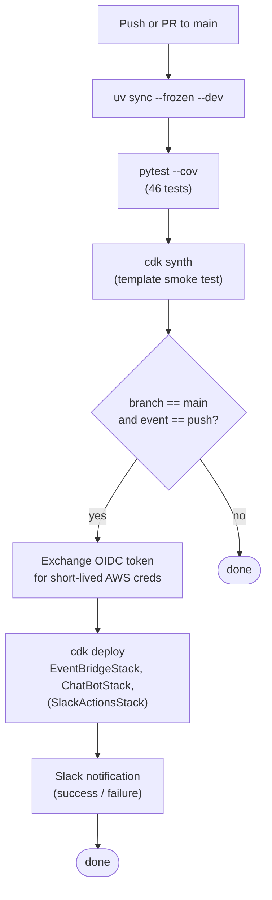

# CI/CD

This project deploys from CI without any long-lived AWS access keys stored in GitHub. The mechanism is GitHub Actions' native OIDC support combined with an IAM role scoped to this repository.

## Why OIDC

The default GitHub Actions deploy pattern stores `AWS_ACCESS_KEY_ID` and `AWS_SECRET_ACCESS_KEY` as GitHub secrets. Those are long-lived: a leak via a stolen developer laptop, a misconfigured log, or a malicious dependency can compromise the keys, and rotating them is manual.

OIDC replaces the long-lived keys with a per-run JSON Web Token. The token is minted by GitHub, scoped to the run, and exchanged for short-lived AWS credentials via `sts:AssumeRoleWithWebIdentity`. The AWS side enforces *who* can assume the role via a trust policy — only the named repo (and optionally only the named branch) is allowed.

End result: no AWS keys live anywhere outside AWS itself.

See [ADR-005](adr/005-github-oidc-for-ci-deploys.md) for the full decision record.

## Components

### `GithubOIDCRoleStack` (`infra/github_oidc_role_stack.py`)

A bootstrap CDK stack that creates:

1. An **OIDC provider** for `token.actions.githubusercontent.com` (skipped if the account already has one — pass `existingOidcProviderArn` context).
2. An **IAM role** with a `WebIdentityPrincipal` trust policy:

   ```
   Action:    sts:AssumeRoleWithWebIdentity
   Principal: { Federated: <oidc-provider-arn> }
   Condition:
     StringEquals:
       token.actions.githubusercontent.com:aud = sts.amazonaws.com
     StringLike:
       token.actions.githubusercontent.com:sub = repo:<org>/<repo>:*
   ```

3. A set of **inline policies** scoped to what CDK needs to deploy:
   - `ssm:GetParameter` on `/cdk-bootstrap/hnb659fds/version`
   - `s3:GetObject/PutObject/ListBucket` on the CDK assets bucket
   - `sts:AssumeRole` on the four CDK bootstrap roles
   - `cloudformation:*` change-set operations

4. A **`CfnOutput`** exposing the role ARN, which becomes the `AWS_DEPLOY_ROLE_ARN` GitHub Actions secret.

### `.github/workflows/ci.yml`

Two jobs.

**Job 1: `test-and-synth`** — runs on every PR and push. No AWS credentials needed:

- Install uv with caching.
- `uv sync --frozen --dev` — fail if `pyproject.toml` and `uv.lock` are out of sync.
- `uv run pytest --cov=infra --cov=lambda` — all 46 unit tests + coverage.
- `cdk synth` against dummy account/region/Slack values — smoke test that the templates compile.

**Job 2: `deploy`** — runs only on push to `main`. Requires `id-token: write` permission to mint the OIDC JWT:

- `aws-actions/configure-aws-credentials@v4` exchanges the OIDC token for short-lived AWS credentials via the `AWS_DEPLOY_ROLE_ARN` role.
- `cdk deploy EventBridgeStack ChatBotStack` (and `SlackActionsStack` when `vars.ENABLE_SLACK_ACTIONS=true`).
- A Slack notification step posts a success/failure message to a webhook (the pipeline-notifications project announces its own deploys).

The OIDC role stack itself is **not** redeployed by CI — it's bootstrap infra. Treating it that way avoids a circular dependency where CI would need to update its own deploy role.

## First-time setup

1. Set the repo identity (env vars are fine; CDK context works too):

   ```bash
   export GITHUB_ORG=Manuelacosta98
   export GITHUB_REPO=aws-data-pipeline-notifications
   ```

2. Deploy the OIDC role stack from a workstation:

   ```bash
   uv run cdk deploy GithubOIDCRoleStack
   ```

3. Note the `GitHubActionsRoleArn` from the stack output.

4. In the GitHub repository → **Settings** → **Secrets and variables** → **Actions**, add:

   | Secret name              | Value                                                        |
   |--------------------------|--------------------------------------------------------------|
   | `AWS_DEPLOY_ROLE_ARN`    | The role ARN from step 3                                     |
   | `AWS_ACCOUNT_ID`         | Your AWS account ID                                          |
   | `AWS_REGION`             | The region you deploy into                                   |
   | `SLACK_WORKSPACE_ID`     | Slack workspace ID for the alert channel                     |
   | `SLACK_CHANNEL_ID`       | Slack channel ID for alerts                                  |
   | `SLACK_WEBHOOK_URL`      | *(optional)* Slack webhook for the CI's self-deploy notifications |

5. If you also want the bidirectional flow deployed from CI, add these *variables* (not secrets — they're not sensitive):

   | Variable name             | Value                                              |
   |---------------------------|----------------------------------------------------|
   | `ENABLE_SLACK_ACTIONS`    | `true`                                             |
   | `ALLOWED_GLUE_JOBS`       | `customer_etl_daily,inventory_sync`                |
   | `ALLOWED_STATE_MACHINES`  | `DataPipeline`                                     |

After step 4 the next push to `main` will deploy.

## What CI does on every commit



## Hardening the OIDC trust policy

The default trust policy allows any branch in the repo to assume the deploy role (`repo:<org>/<repo>:*`). To require deploys come only from `main`:

```python
"StringLike": {
    "token.actions.githubusercontent.com:sub":
        f"repo:{github_org}/{github_repo}:ref:refs/heads/main"
}
```

This is recommended for production accounts. For a portfolio project it's optional.

## Environment promotion (not yet implemented)

The current setup is single-environment — one push to `main`, one deploy. A natural extension is dev/staging/prod separation:

- Three separate AWS accounts, each with its own `GithubOIDCRoleStack` deployed.
- Three GitHub Actions environments (`dev`, `staging`, `prod`) with their own `AWS_DEPLOY_ROLE_ARN` secrets.
- CI workflow with a matrix or sequential jobs that deploy each in turn, with manual approval gates on production.

The trust policy for the prod role would constrain `sub` to `environment:prod`, and the GitHub environment would require reviewers before the OIDC token is minted.

## Verification

```bash
uv run pytest tests/unit/test_github_oidc_role_stack.py -v
```

Four tests guard the OIDC stack:

- `test_role_trusts_only_the_named_github_repository` — the `sub` constraint is exactly the configured repo.
- `test_role_arn_is_exported_as_cfn_output` — the operator can find the ARN to set as a GitHub secret.
- `test_role_can_assume_cdk_bootstrap_roles` — `sts:AssumeRole` policy is in place.
- `test_missing_repo_raises` — constructor refuses to provision a role without a repo scope.
