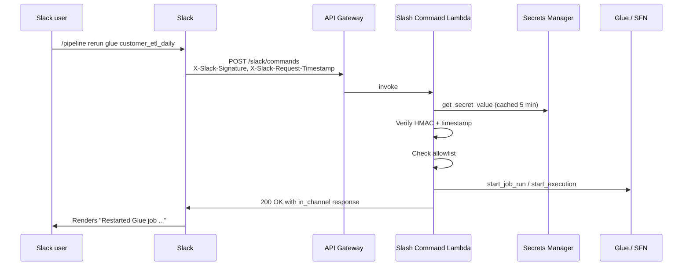

# Inbound actions

The inbound flow lets a Slack user re-run a failed Glue job or Step Functions execution with a slash command. It is opt-in because it provisions an internet-facing endpoint and requires a Slack app.

## Flow



End-to-end latency is well under a second once the Lambda is warm.

## Components

### API Gateway HTTP API

- `apigwv2.HttpApi` with one route: `POST /slack/commands`.
- Integrated to the Lambda via `HttpLambdaIntegration`.
- No usage plans, no API keys — the trust boundary is the Slack signing secret.

### Slash Command Lambda (`lambda/slack_command_handler.py`)

Single handler. The flow inside:

1. **Load the signing secret.** Lazy-loaded from Secrets Manager and cached for 5 minutes via the `_cached_secret` module-level dict. A rotation in Secrets Manager propagates within 5 minutes without a redeploy.
2. **Verify the HMAC.** Build `v0:<timestamp>:<body>`, HMAC-SHA256 with the signing secret, prefix with `v0=`, compare against `X-Slack-Signature` with `hmac.compare_digest` (constant-time). Reject with HTTP 401 on mismatch.
3. **Reject replays.** If `|now - timestamp| > 300` seconds, return 401. Slack's recommended replay window.
4. **Parse the form-encoded body.** `text` is the part after the slash command; `user_id` is the Slack user.
5. **Dispatch on the verb.** `help`, `rerun glue <name>`, `rerun sfn <name|arn>`.
6. **Enforce the allowlist.** For `rerun`, the target name must appear in the `ALLOWED_GLUE_JOBS` / `ALLOWED_STATE_MACHINES` env vars. Note that the IAM policy is *also* scoped to the same names — see [security.md](security.md) on defense in depth.
7. **Call AWS.** `glue.start_job_run(JobName=...)` or `stepfunctions.start_execution(stateMachineArn=..., input='{}')`.
8. **Respond to Slack.** Help and rejections return `response_type: "ephemeral"` (only the user sees them). Successful re-runs return `response_type: "in_channel"` so the team has a shared audit trail, including a `<@user_id>` mention.

### Secrets Manager entry

Holds the Slack signing secret as a string. The CDK stack creates the entry but **does not set the value** — the operator does that out-of-band, post-deploy. This keeps secrets out of source control and out of CloudFormation parameter logs.

## Command grammar

```
/pipeline help
/pipeline rerun glue <job_name>
/pipeline rerun sfn <state_machine_name_or_arn>
```

The state-machine variant accepts either:

- A bare name (e.g. `DataPipeline`) — the handler synthesizes the ARN using `context.invoked_function_arn` for the account ID and `os.environ["AWS_REGION"]` for the region.
- A full ARN — passed through unchanged. The bare name is extracted for the allowlist check.

Anything else returns `:warning: Unrecognized command. Try /pipeline help.`

## Slack app setup

End-to-end checklist when enabling this feature for the first time.

### 1. Create the Slack app

[Slack API console](https://api.slack.com/apps) → **Create New App** → **From scratch**:

- App name: anything (`aws-data-pipeline` is fine).
- Workspace: the same one your Chatbot integration uses for outbound alerts.

### 2. Configure the slash command

In the app's left nav:

- **Slash Commands** → **Create New Command**
  - Command: `/pipeline`
  - Request URL: *will be filled in after CDK deploy*
  - Short description: `Re-run failed pipeline jobs`
  - Usage hint: `rerun glue|sfn <name>`

### 3. Install to workspace

**OAuth & Permissions** → **Install to Workspace**. No special bot scopes are needed for slash commands — the command runs in the user's session, not as a bot.

### 4. Note the signing secret

**Basic Information** → **App Credentials** → copy the **Signing Secret**. You will paste this into Secrets Manager in step 6.

### 5. Deploy the stack

```bash
uv run cdk deploy SlackActionsStack \
  -c enableSlackActions=true \
  -c allowedGlueJobs=customer_etl_daily,inventory_sync \
  -c allowedStateMachines=DataPipeline
```

The stack outputs:

- `SlackCommandsUrl` — paste into the Slack app's slash command **Request URL** field.
- `SlackSigningSecretArn` — the Secrets Manager entry you'll populate next.

### 6. Set the signing secret

```bash
aws secretsmanager put-secret-value \
  --secret-id aws-data-pipeline-notifications/slack-signing-secret \
  --secret-string '<paste-signing-secret-from-slack>'
```

Or via the AWS console: Secrets Manager → find the secret → **Retrieve secret value** → **Edit** → paste.

### 7. Save the Slack app

Back in the Slack API console, paste `SlackCommandsUrl` into the slash command's Request URL and **Save**.

### 8. Try it

In Slack:

```
/pipeline help
/pipeline rerun glue customer_etl_daily
/pipeline rerun sfn DataPipeline
```

The first call is ephemeral (only you see it). Successful re-runs post in-channel with a `<@user_id>` mention so the team has an audit trail.

## Rotating the signing secret

If you suspect the signing secret has leaked:

1. Rotate it in the Slack app (Basic Information → Reset Signing Secret).
2. Update Secrets Manager:
   ```bash
   aws secretsmanager put-secret-value \
     --secret-id aws-data-pipeline-notifications/slack-signing-secret \
     --secret-string '<new-secret>'
   ```
3. The Lambda's 5-minute in-memory cache picks up the new secret on the next refresh. No redeploy needed.

In a true emergency, set the secret to a random string (which will reject all Slack requests with 401) while you investigate.

## Limitations

- **No `status` query yet.** Once a re-run is triggered, the user has to check the AWS console for status. A `/pipeline status <run-id>` command would be a small addition.
- **No `--from <execution-arn>` for Step Functions.** Re-runs start with empty input. Replaying a failed execution with its original input would need a `describe_execution` call first.
- **Slack-only.** The same Lambda could in principle accept commands from Microsoft Teams or Mattermost with different signature schemes — but right now it's hard-coded to Slack's `v0:` format.

## Extending it

To add a new command:

1. Add a new branch in `slack_command_handler.lambda_handler` after the existing `rerun` block.
2. Add per-action IAM permissions in `infra/slack_actions_stack.py` via `handler.add_to_role_policy(...)`.
3. Add tests in `tests/unit/test_slack_command_handler.py` covering the happy path, allowlist rejection, and any error modes.
