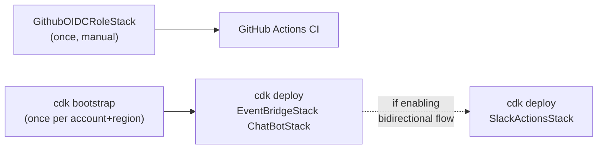

# Operations

Runbook for the people who deploy this, rotate its secrets, change its allowlists, debug missing alerts, or tear it down.

## Deploy order



1. `cdk bootstrap` — once per account/region. Provisions the CDK staging assets.
2. `cdk deploy GithubOIDCRoleStack` — once. The output ARN becomes the `AWS_DEPLOY_ROLE_ARN` GitHub secret. From here on, CI deploys everything else.
3. `cdk deploy EventBridgeStack ChatBotStack` — the outbound flow. Push to `main` triggers this.
4. `cdk deploy SlackActionsStack -c enableSlackActions=true -c allowedGlueJobs=... -c allowedStateMachines=...` — opt-in bidirectional flow.

`ChatBotStack` depends on `EventBridgeStack` for the SNS topic ARN. CDK handles ordering automatically.

## Deploy from a workstation

```bash
git pull
uv sync --frozen --dev
uv run cdk diff EventBridgeStack ChatBotStack   # preview
uv run cdk deploy EventBridgeStack ChatBotStack
```

If you have a deploy-from-laptop ban, use [CI/CD](cicd.md) instead — push to `main`.

## Configure the Slack workspace (one-time)

Before the very first deploy of `ChatBotStack`, the AWS Chatbot integration must be authorized for your Slack workspace:

1. AWS Console → Chatbot → **Configure new client** → **Slack** → authorize the OAuth flow.
2. Copy the **Workspace ID** (starts with `T`) and the **Channel ID** (starts with `C`).
3. Put them in `.env` for local deploys, or in GitHub secrets for CI deploys.

You only do this once. The workspace authorization persists across redeploys.

## Set up the inbound Slack app

See [`docs/inbound-actions.md` § Slack app setup](inbound-actions.md#slack-app-setup) for the eight-step walkthrough.

## Rotate the Slack signing secret

If the signing secret has leaked, or you want to rotate proactively:

1. **Rotate in the Slack app.** API console → your app → **Basic Information** → **App Credentials** → **Reset Signing Secret**.
2. **Update Secrets Manager.**
   ```bash
   aws secretsmanager put-secret-value \
     --secret-id aws-data-pipeline-notifications/slack-signing-secret \
     --secret-string '<new-secret>'
   ```
3. **Wait up to 5 minutes** for the Lambda's in-memory cache to refresh, *or* trigger a redeploy of `SlackActionsStack` to flush the cache immediately.

There is a small window (up to 5 minutes) where Lambda containers may still validate against the old secret. Live with it, or accept the cold-start cost of a redeploy.

## Add a new Glue job to the allowlist

Editing `cdk.json` is the path:

```jsonc
"context": {
  "allowedGlueJobs": "customer_etl_daily,inventory_sync,NEW_JOB"
}
```

Then redeploy:

```bash
uv run cdk deploy SlackActionsStack
```

Two things change in one deploy:

- The Lambda's `ALLOWED_GLUE_JOBS` env var widens.
- The IAM policy's `Resource` array adds `arn:aws:glue:<region>:<account>:job/NEW_JOB`.

A CI deploy can do the same via the `vars.ALLOWED_GLUE_JOBS` GitHub Actions variable.

## Add a new AWS source to monitor

See [`docs/outbound-alerts.md` § Extending it](outbound-alerts.md#extending-it).

The five steps:

1. Add an `events.Rule(...)` block in `infra/eventbridge_stack.py`.
2. Add a `_format_<source>` method to `lambda/event_formatter.py`.
3. Add a dispatch line in `_dispatch`.
4. Add a `tests/unit/test_lambda_formatter.py` case.
5. Optionally add an IAM read action to the Chatbot role's inline policy if Chatbot needs new context to render this source's alerts.

## Debug a missing alert

Symptom: an AWS service failed (Glue / DMS / SFN), but no Slack message arrived.

Diagnose in this order:

1. **Did EventBridge see the event?**
   - AWS Console → CloudWatch → Metrics → namespace `AWS/Events` → `Invocations` metric for the rule (e.g. `EventBridgeStack-GlueFailures...`).
   - Or check the rule's `FailedInvocations` metric. A positive value means the rule fired but Lambda invocation failed.
2. **Did the formatter Lambda run?**
   - CloudWatch Logs → `/aws/lambda/EventBridgeStack-MessageFormatter...`
   - Look for the `Received event:` log line. If it's there, the event reached Lambda.
3. **Did SNS publish?**
   - The Lambda log should end with `Published Chatbot payload to ...`.
   - If you see this but no Slack message, the issue is downstream of SNS.
4. **Did Chatbot deliver to Slack?**
   - Chatbot doesn't expose detailed logs by default. The fastest check is to send a test message to the SNS topic from the AWS console (Publish message) and see if Chatbot renders it.
   - If Chatbot is silent, re-check the Slack workspace authorization and the channel ID.

The most common cause of a missing alert is the AWS service simply not emitting the expected event — Glue does not emit `Glue Job State Change` for some failure modes, for example. When in doubt, replay a known-failing event into EventBridge with the AWS CLI:

```bash
aws events put-events --entries file://test-event.json
```

## Add a CloudWatch alarm on the formatter Lambda

The system does not currently alert on its own failures. To add one:

```python
# in infra/eventbridge_stack.py, after the formatter Lambda is created
cw.Alarm(self, "FormatterErrors",
    metric=formatter.metric_errors(),
    threshold=1,
    evaluation_periods=1,
    alarm_action=cw_actions.SnsAction(topic),  # post into the same SNS topic
)
```

The alarm publishes to the same SNS topic, which means a formatter failure alerts via the same Chatbot integration. A misconfigured formatter would still cause the alarm to fail to post — at that point you fall back to AWS Console.

## Tear it down

For a clean removal:

```bash
uv run cdk destroy SlackActionsStack   # only if it was deployed
uv run cdk destroy ChatBotStack
uv run cdk destroy EventBridgeStack
uv run cdk destroy GithubOIDCRoleStack
```

Two things CDK does **not** clean up automatically:

- **The Slack app.** Delete it manually in the Slack API console.
- **The Slack workspace ↔ Chatbot OAuth connection.** Revoke in AWS Console → Chatbot → Workspaces.

## Future improvements

- **Dead-letter queue** on the formatter Lambda. A misconfigured Slack channel currently drops alerts silently.
- **Self-monitoring alarm.** See the section above.
- **`/pipeline status <run-id>`** for checking a job after re-running it.
- **Multi-channel fan-out.** Subscribe email or PagerDuty to the same SNS topic for higher-severity alerts.
- **Per-Slack-user authorization** in `slack_command_handler` — the current model trusts any user in the workspace; richer setups would gate by `user_id` allowlist.
