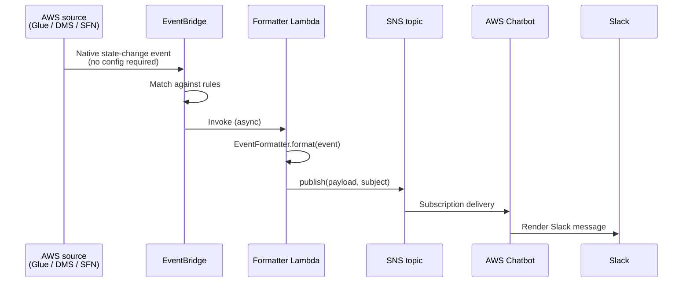

# Outbound alerts

The outbound flow turns AWS service failure events into Slack messages. It is the original feature and the one that's always on.

## Flow



End-to-end latency is typically under five seconds. Most of that is Chatbot's render pipeline; EventBridge → Lambda → SNS is sub-second.

## Components

### EventBridge rules (`infra/eventbridge_stack.py`)

One rule per AWS source × failure-state set. Each rule targets the formatter Lambda.

| Rule ID                  | Source       | Detail-type                                    | Detail filter                                   |
|--------------------------|--------------|------------------------------------------------|-------------------------------------------------|
| `StepFunctionFailures`   | `aws.states` | `Step Functions Execution Status Change`       | `status ∈ {FAILED, TIMED_OUT, ABORTED}`         |
| `DMSFailures`            | `aws.dms`    | `DMS Replication Task State Change`            | `state ∈ {stopped, failed}`                     |
| `DMSTableFailures`       | `aws.dms`    | `DMS Table State Change`                       | `state ∈ {Table error, Table completed with issues}` |
| `GlueFailures`           | `aws.glue`   | `Glue Job State Change`                        | `state ∈ {FAILED, STOPPED, ERROR}`              |
| `QuickSightIngestionFailures` | `aws.quicksight` | `QuickSight Dataset SPICE Ingestion Completed` | `ingestionStatus ∈ {FAILED, CANCELLED}` |
| `RedshiftLoadCheckRule`  | `custom.redshift` | `Redshift Load Failure / Success`         | (emitted by the Redshift monitor — see [proactive-monitors.md](proactive-monitors.md)) |
| `DmsLogCheckRule`        | `custom.dms` | `DMS Log Errors / Success`                     | (emitted by the DMS monitor — see [proactive-monitors.md](proactive-monitors.md)) |
| `StepFunctionSuccesses`  | `aws.states` | `Step Functions Execution Status Change`       | `status = SUCCEEDED` *(opt-in)*                  |

The success rule is gated on the `notifyOnPipelineSuccess` CDK context flag, off by default. Step Functions success events can be noisy in busy accounts; we let the operator opt in. See [severity classification](severity-classification.md#opt-in-success-notifications).

### Formatter Lambda

Two files:

- **`lambda/lambda_formatter.py`** — 13 lines, the AWS Lambda entry point. Reads `AWS_REGION` and `RERUN_HINTS_ENABLED` env vars once at module-import time, constructs an `EventFormatter`, and reuses both across warm invocations.
- **`lambda/event_formatter.py`** — the `EventFormatter` class with one method per AWS source.

Splitting handler from formatter has two payoffs:

1. **Tests don't need to mock Lambda.** Construct an `EventFormatter` directly, call `.format()`, assert on the returned dict. This is why `tests/unit/test_lambda_formatter.py` runs in 4 seconds for 12 cases.
2. **Adding a new source is a one-method change.** Add `_format_<source>`, register it in `_dispatch`. No changes to the I/O glue.

The dispatch lives in `EventFormatter._dispatch`:

```python
def _dispatch(self, source, detail_type):
    if source == "aws.states":
        return self._format_step_functions
    if source == "aws.glue":
        return self._format_glue
    if source == "aws.dms":
        if detail_type == "DMS Table State Change":
            return self._format_dms_table
        return self._format_dms_task
    return self._format_unknown
```

Each per-source method returns a 4-tuple of `(title, description, log_url, severity)`. The class wraps that into Chatbot's custom message format.

### SNS topic

A single SNS topic, `DataPipelineFailures`, with `TracingConfig.ACTIVE` so X-Ray tracing captures the full Chatbot → Slack hop if needed. The topic ARN is exported from `EventBridgeStack` and imported by `ChatBotStack` — see [architecture.md § Cross-stack contracts](architecture.md#cross-stack-contracts).

### AWS Chatbot

`ChatBotStack` creates a single `SlackChannelConfiguration` subscribed to the SNS topic. The role attached to that configuration is **not** the broad managed `CloudWatchReadOnlyAccess` policy; it's an inline least-privilege policy with only the CloudWatch / Logs / SNS read actions Chatbot needs to render context. The regression guard for this lives in `tests/unit/test_chatbot_stack.py:test_chatbot_role_does_not_attach_managed_cloudwatch_readonly`.

When `enableProactiveMonitors=true` is set and the relevant env vars are provided, the same Chatbot role is *also* granted `lambda:InvokeFunction` on the named monitor function ARNs. This lets users invoke the proactive monitors directly from Slack via `@aws lambda invoke --function-name CheckRedshiftErrors`. See [ADR-008](adr/008-chatbot-invocation-alongside-slash-commands.md) for the design rationale.

### Active enrichment for QuickSight

The QuickSight branch is the one place where the formatter actively calls AWS APIs *while* formatting an event. EventBridge gives us the dataset ID (opaque) and a generic error type; the formatter calls `describe_data_set` to resolve the human-readable dataset name and `describe_ingestion` to get the detailed error message. Both calls are best-effort — a permissions failure falls back to the EventBridge payload values, the alert still ships.

This pattern is documented in [ADR-009](adr/009-active-enrichment-via-boto3.md). The IAM grant lives on the formatter Lambda's role in `infra/eventbridge_stack.py`.

## Message format

Chatbot's custom format looks like:

```json
{
  "version": "1.0",
  "source": "custom",
  "content": {
    "textType": "client-markdown",
    "title": "🚨 Glue Job Failed",
    "description": "Job: customer_etl_daily\nState: FAILED\nError: ...\n\n🔁 To re-run: `/pipeline rerun glue customer_etl_daily`\n\n<https://console.aws.amazon.com/...|View in AWS Console>",
    "nextSteps": ["Check the AWS Console for more details"],
    "keywords": ["aws.glue", "error", "data-pipeline"]
  }
}
```

The `keywords` array is searchable in Slack — useful for Workflow Builder filters or simple `is:keyword` searches when you need to find "all error alerts from last week."

The re-run hint (`🔁 To re-run: ...`) only appears when `RERUN_HINTS_ENABLED=true` is set on the formatter Lambda, which `EventBridgeStack` sets only when the user enables the bidirectional flow via `enableSlackActions` context. See [inbound actions](inbound-actions.md).

## Limitations

- **No colored attachment bars.** AWS Chatbot's custom format doesn't expose Slack's color attribute. Severity is conveyed via emoji prefix (`🚨/⚠️/✅/ℹ️`) and `keywords` tags. To get colored bars you'd have to bypass Chatbot and post directly to a Slack webhook — see [ADR-002](adr/002-aws-chatbot-for-outbound.md) for the trade-off.
- **No dead-letter queue on the formatter Lambda.** A misconfigured Slack channel will silently swallow alerts. This is on the [operations](operations.md#future-improvements) list.
- **No alarm on the formatter Lambda itself.** The system does not alert on its own failures. Also on the operations list.

## Extending it

To add a new AWS source:

1. Pick the EventBridge event pattern from the [AWS Events documentation](https://docs.aws.amazon.com/eventbridge/latest/userguide/eb-event-patterns.html).
2. Add an `events.Rule(...)` in `infra/eventbridge_stack.py` targeting the formatter Lambda.
3. Add a `_format_<source>` method to `EventFormatter` that returns `(title, description, log_url, severity)`.
4. Add a dispatch line in `_dispatch`.
5. Add a test case in `tests/unit/test_lambda_formatter.py` asserting on the published payload for that source.

The whole cycle is roughly 30 lines of code plus the test.
