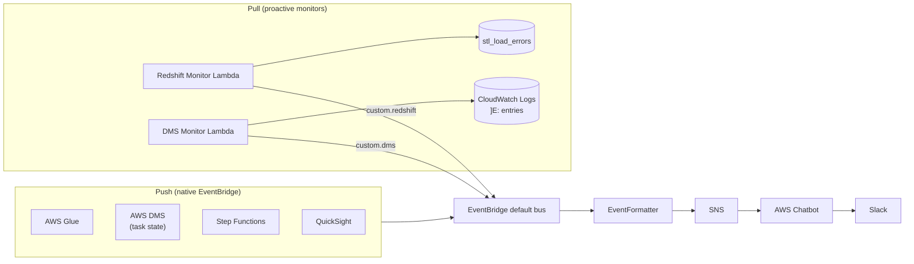

# Proactive monitors

AWS doesn't emit EventBridge events for every failure mode that matters to a data pipeline. **Redshift COPY load errors** live in the `stl_load_errors` system table. **DMS field-level errors** live in CloudWatch Logs as `]E:` lines. Neither is a native event source.

To cover these without changing the rest of the architecture, the project ships two opt-in **proactive monitors** — Lambda functions that poll the relevant data sources on demand and emit *custom* EventBridge events that flow through the **same formatter** as native AWS events. The end result: a unified Slack channel that mixes push-based and pull-based alerts seamlessly.

## The hybrid push + pull pattern



The architectural insight is that **the formatter Lambda doesn't care whether an event came from AWS natively or from one of our pollers**. As long as the event has a `source` (`custom.redshift`, `custom.dms`) and a `detail-type`, the formatter dispatches on it the same way. New monitors are additive — write a new poller Lambda, choose a new `custom.*` source, add an EventBridge rule and a formatter method.

See [ADR-007](adr/007-hybrid-push-pull-monitoring.md) for the decision record.

## Redshift load-error monitor

### What it does

Queries `stl_load_errors` via the **Redshift Data API** (no psycopg2, no Lambda layers, IAM-authenticated), takes the most recent N errors, and emits a `custom.redshift` event with the structured detail payload.

### Files

- `infra/redshift_monitor_stack.py` — CDK stack: Lambda + IAM (`redshift-data:*`, `redshift:GetClusterCredentials`, `events:PutEvents`).
- `lambda/redshift_monitor.py` — handler that submits the query, polls for completion, formats the result.

### Configuration

```bash
REDSHIFT_CLUSTER_ID=redshiftcluster-fsmrky3lmyqk
REDSHIFT_DATABASE=analytics
REDSHIFT_DB_USER=reporter
```

Then deploy:

```bash
uv run cdk deploy RedshiftMonitorStack -c enableProactiveMonitors=true
```

### Invoke paths

Two ways to fire the monitor:

1. **Slack (via AWS Chatbot's native invocation):**
   ```
   @aws lambda invoke --function-name CheckRedshiftErrors
   ```
   The Chatbot IAM role's `lambda:InvokeFunction` is scoped to the monitor's ARN — see `infra/chatbot_stack.py` and [ADR-008](adr/008-chatbot-invocation-alongside-slash-commands.md).
2. **Scheduled (cron):** add an `events.Rule(schedule=Schedule.cron(...))` targeting the monitor Lambda. Not configured by default — leave to operator preference.

### Event payload

```json
{
  "Source": "custom.redshift",
  "DetailType": "Redshift Load Failure",
  "Detail": {
    "cluster": "redshiftcluster-abc",
    "database": "analytics",
    "error_count": 2,
    "status": "failure",
    "check_period": "all available records",
    "error_details": [
      {
        "starttime": "2026-05-26 14:02:11",
        "filename": "claims.csv",
        "err_reason": "String length exceeds DDL length",
        "colname": "policy_holder_name"
      }
    ]
  }
}
```

### Slack rendering

`EventFormatter._format_custom_redshift` produces:

> 🚨 **Redshift Load Errors Detected**
> Cluster: redshiftcluster-abc
> Database: analytics
> Total errors: 2 (all available records)
>
> 📋 Recent errors (showing up to 10):
>
> 1. Time: 2026-05-26 14:02:11
>    File: claims.csv
>    Reason: String length exceeds DDL length
>    Column: policy_holder_name
>
> *(View in AWS Console)*

When `error_count == 0`, the same path emits `✅ Redshift Load Check — No Errors` instead. The formatter uses the existing severity classification — see [severity-classification.md](severity-classification.md).

## DMS load-error monitor

### What it does

Combines two data sources for a complete error picture:

1. **`DescribeReplicationTableStatistics`** — per-table row counts and error counts. Pages through *all* tables in the replication config.
2. **CloudWatch Logs filter** for `]E:` — DMS prefixes individual row-level errors with this marker; we filter for them inside a configurable lookback window.

Emits a `custom.dms` event with both table-level stats and field-level log entries.

### Files

- `infra/dms_monitor_stack.py` — CDK stack: Lambda + IAM (`dms:DescribeReplicationTableStatistics` scoped to the replication ARN, `logs:FilterLogEvents` scoped to the specific log group, `events:PutEvents`).
- `lambda/dms_monitor.py` — handler that combines the two data sources.

### Configuration

```bash
DMS_TASK_ARN=arn:aws:dms:us-east-1:111111111111:replication-config:my-config
DMS_LOG_GROUP=/aws/dms/serverless-replication/my-config
DMS_LOG_HOURS_BACK=24
```

Then deploy:

```bash
uv run cdk deploy DmsMonitorStack -c enableProactiveMonitors=true
```

### Invoke paths

Same two as Redshift:

```
@aws lambda invoke --function-name CheckDMSErrors
```

…or a scheduled EventBridge rule.

### Event payload

```json
{
  "Source": "custom.dms",
  "DetailType": "DMS Log Errors",
  "Detail": {
    "log_group": "/aws/dms/serverless/...",
    "hours_back": 24,
    "status": "failure",
    "total_table_errors": 1,
    "total_field_errors": 14,
    "error_tables": [
      {
        "schema": "public",
        "table": "policies",
        "state": "Table error",
        "full_load_rows": 1000,
        "full_load_error_rows": 12
      }
    ],
    "field_errors": [
      {
        "timestamp": "2026-05-26 14:02:11 UTC",
        "message": "2026-05-26T14:02:11 [SOURCE_UNLOAD   ]E:  value exceeds length (file_unload.c:628)"
      }
    ]
  }
}
```

### Log cleanup

DMS log lines are noisy:

```
2026-05-26T14:02:11 [SOURCE_UNLOAD   ]E:  value exceeds length (file_unload.c:628)
```

The formatter calls `clean_dms_log_message()` (in `lambda/event_formatter.py`) which strips:

- The leading timestamp (we surface it separately as a label).
- The component+level prefix (`[SOURCE_UNLOAD   ]E:`).
- The trailing internal file reference (`(file_unload.c:628)`).

The cleaned message becomes: `value exceeds length`. Three regex passes, three tests, real UX win.

## Cost

Both monitors are essentially free at typical use:

- Redshift Data API: no per-statement charge; you pay for the underlying cluster compute (which you already pay for).
- DMS Table Statistics: free, included in DMS pricing.
- CloudWatch Logs FilterLogEvents: $0.005 per GB scanned. For a 24h window of DMS logs that's pennies per invocation.
- Lambda: well within the free tier at one invocation per hour.

Running both monitors hourly costs less than $0.01/month at typical production volumes.

## Testing

- Stack tests: `tests/unit/test_redshift_monitor_stack.py`, `tests/unit/test_dms_monitor_stack.py` (CDK template assertions).
- Handler tests: `tests/unit/test_redshift_monitor.py`, `tests/unit/test_dms_monitor.py` (boto3-mocked, asserting on the emitted EventBridge payload).
- Formatter tests: `test_lambda_formatter.py:test_custom_redshift_*` and `test_custom_dms_*`.

## Extending

To add a new proactive monitor (e.g. Kinesis stream lag):

1. Pick a `custom.<thing>` source name and decide on success/failure `detail-type` strings.
2. Write the poller: `lambda/<thing>_monitor.py`. Use boto3 to query the source. Build a structured detail payload. Call `events.put_events(...)`.
3. Write the stack: `infra/<thing>_monitor_stack.py`. Provision the Lambda, scope its IAM policies, give it `events:PutEvents`.
4. Add a `_format_custom_<thing>` method to `EventFormatter` and a dispatch line in `_dispatch`.
5. Add an EventBridge rule in `EventBridgeStack` matching the new source.
6. Tests at all three layers (handler, stack, formatter).
7. If you want it Slack-invocable, add the function name to `invokable_function_names` in `app.py` so the Chatbot stack grants `lambda:InvokeFunction` on it.

Total: ~250 lines for a new monitor end-to-end.
